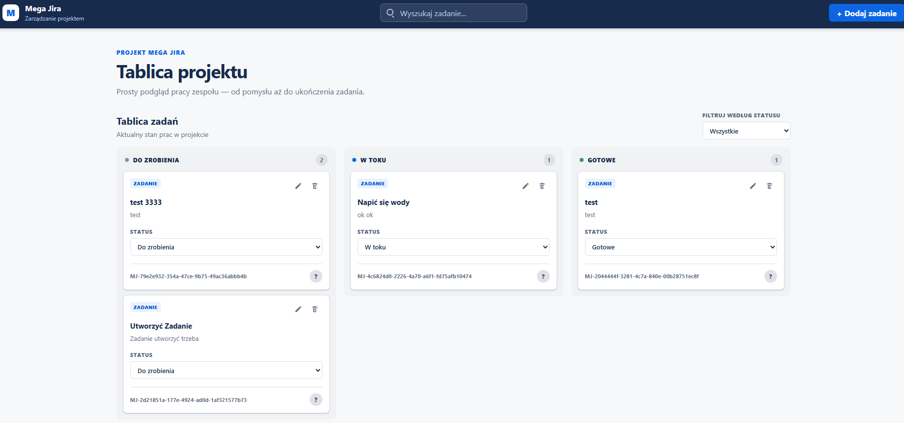

# Mega Jira

Mega Jira is a lightweight project management application inspired by Jira. It provides a Kanban board for creating, organizing, and tracking tasks across **To Do**, **In Progress**, and **Done**.

The current version runs entirely in the browser and saves tasks in `localStorage`.

## Features

- Create tasks with a title, description, and status
- Edit existing tasks using the same form used for task creation
- Delete tasks with a confirmation prompt
- Change task statuses manually
- Drag and drop tasks between columns, including empty columns
- Move tasks using the keyboard, with focus preserved after dropping
- Search tasks by title and description
- Filter tasks by status and combine filtering with search
- Display a message when no tasks match
- Track task counts on the board
- Preserve tasks and their changes after refreshing the page
- Handle missing or invalid JSON in `localStorage` without crashing
- Use responsive layouts on desktop, tablet, and mobile

## Tech Stack

- React
- TypeScript
- Vite
- Redux Toolkit and React Redux
- dnd-kit (`@dnd-kit/react`)
- Sass (SCSS)
- Browser `localStorage`

## Testing

Tests use **Vitest**, **React Testing Library**, **user-event**, and **jest-dom**, with **jsdom** providing the browser-like environment.

The test suite covers:

- Task reducers: creation, editing, deletion, and status changes
- Saving and loading tasks, including empty storage and invalid JSON
- Adding tasks through the form and preventing submission without a title
- Editing an existing task without changing its ID or other tasks
- Deleting a task through the board and checking both the UI and Redux state

Component integration tests use a real Redux store rather than mocked Redux hooks.

## Planned Features

- A REST API built with Node.js, Express, TypeScript, and MongoDB
- Backend persistence to replace `localStorage`
- Authentication and time tracking
- End-to-end tests with Playwright

## Preview

