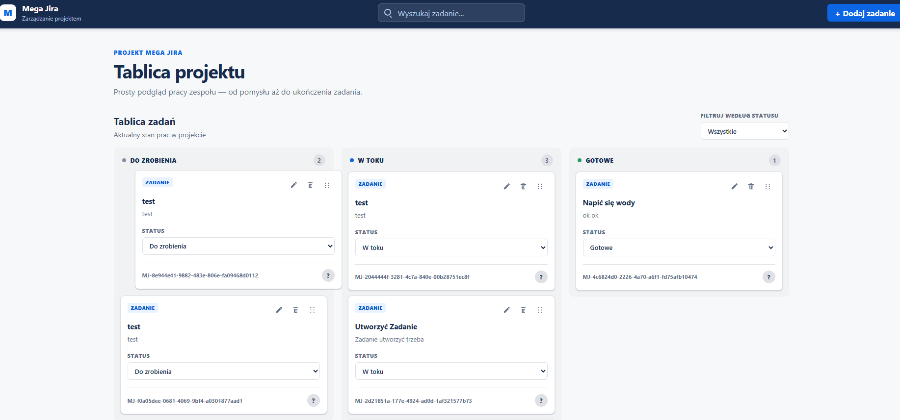

# Mega Jira

Mega Jira is a lightweight project management application inspired by Jira. It provides a Kanban board for creating, organizing, and tracking tasks across **To Do**, **In Progress**, and **Done**.

The application consists of a React frontend and an Express REST API. Tasks are persisted in MongoDB and the client communicates with the API through RTK Query.

## Project Structure

- `client/` — React frontend, Redux store, and RTK Query API client
- `server/` — Express REST API, MongoDB models, and OpenAPI documentation

## Local Development

The application requires Node.js, npm, and a running MongoDB instance.

Create `server/.env` based on `server/.env.example`:

```env
PORT=3001
MONGODB_URI=mongodb://127.0.0.1:27017/mega-jira
```

Install dependencies and start the API:

```bash
cd server
npm install
npm run dev
```

In a second terminal, install dependencies and start the frontend:

```bash
cd client
npm install
npm run dev
```

During development, Vite proxies frontend requests from `/api` to `http://localhost:3001`.

## API

The REST API exposes the following endpoints:

- `GET /api/health` — check API availability
- `GET /api/tasks` — list tasks
- `POST /api/tasks` — create a task
- `PATCH /api/tasks/:id` — update a task
- `DELETE /api/tasks/:id` — delete a task

Interactive API documentation is available at `http://localhost:3001/api/docs`.
The OpenAPI document is available at `http://localhost:3001/api/docs.json`.

## Features

- Create tasks with a title, description, and status
- Edit existing tasks using the same form used for task creation
- Delete tasks with a confirmation prompt
- Change task statuses manually
- Drag and drop tasks between columns, including empty columns
- Move tasks using the keyboard, with focus preserved after dropping
- Search tasks by title and description
- Filter tasks by status and combine filtering with search
- Display a message when no tasks match
- Track task counts on the board
- Persist tasks and their changes in MongoDB
- Fetch and mutate server data with RTK Query
- Automatically refresh cached task data after mutations
- Use responsive layouts on desktop, tablet, and mobile

## Tech Stack

- React
- TypeScript
- Vite
- Redux Toolkit and React Redux
- RTK Query
- dnd-kit (`@dnd-kit/react`)
- Sass (SCSS)

Backend:

- Node.js
- Express
- TypeScript
- MongoDB and Mongoose
- OpenAPI and Swagger UI

## Testing

Tests use **Vitest**, **React Testing Library**, **user-event**, and **jest-dom**, with **jsdom** providing the browser-like environment.

> **Current status:** the existing tests are outdated after replacing the local Redux CRUD and `localStorage` persistence with RTK Query. Some tests still create a store with the old task reducer, dispatch the old synchronous actions, or assert values stored in `localStorage`, so they are not expected to pass until the migration is complete.

The tests need to be rewritten to:

- create a test store containing `tasksApi.reducer` and `tasksApi.middleware`
- mock `GET`, `POST`, `PATCH`, and `DELETE` requests with **Mock Service Worker (MSW)**
- wait for asynchronous API results with React Testing Library queries such as `findBy...` and `waitFor`
- verify loading, success, error, and empty-data states
- verify that mutations invalidate the `Task` tag and refresh the task list
- remove tests for the obsolete task reducer and `localStorage` helpers after those modules are removed

## Planned Features

- Authentication and time tracking
- End-to-end tests with Playwright

## Preview


